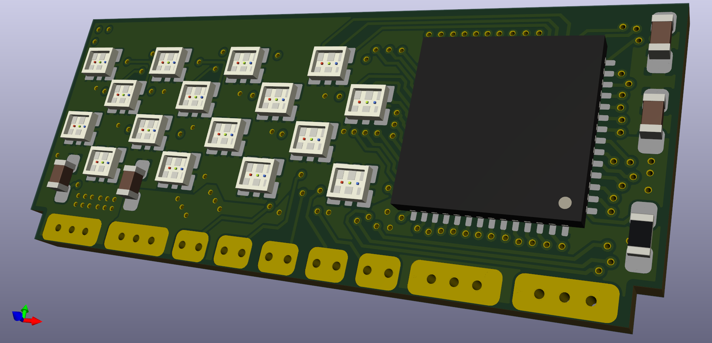

# magic_amulet_pcb
PCB for magic amulet

LED-Driver: TLC5957 (48ch CC 9-16Bit-PWM driver)

LED: [Rohm MSL0402RGB](https://www.rohm.com/datasheet/MSL0402RGBU) (1.8x1.6x0.5mm RGB)

4layer board - uses 150mil traces and 100mil trace spacing.

pcb are in production at [aisler](https://aisler.net/s-light/magic_amulet/led-board-4x4-hd)
