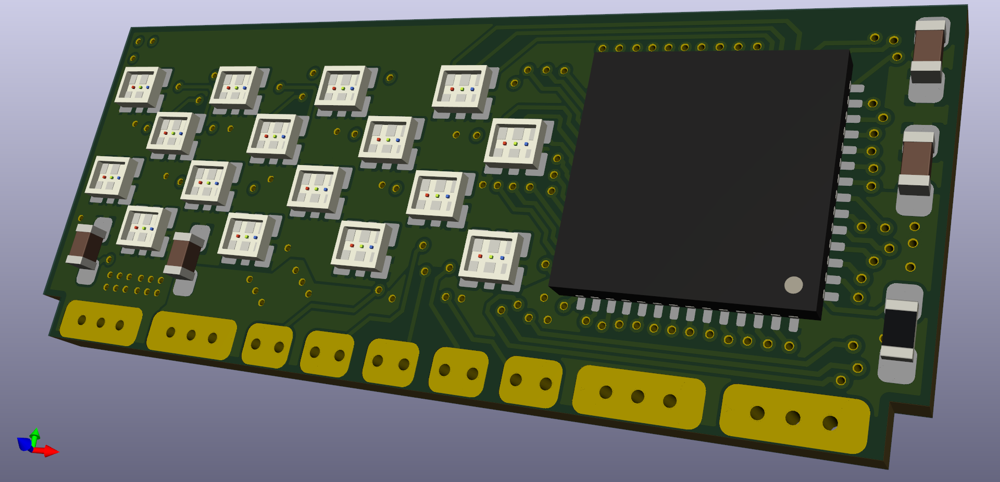
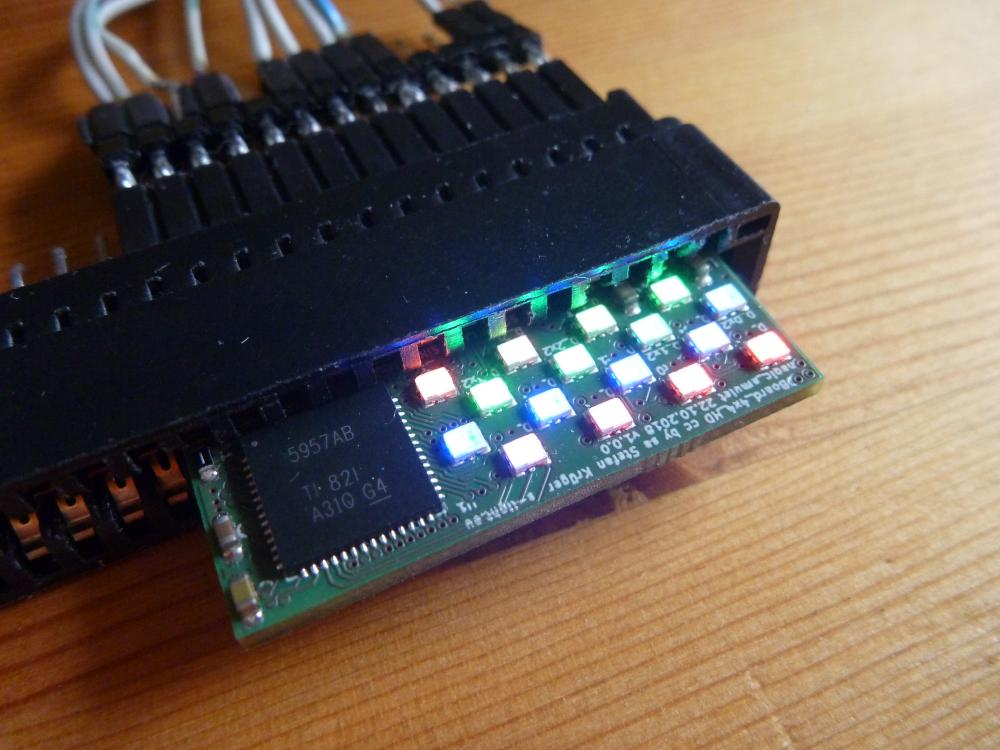
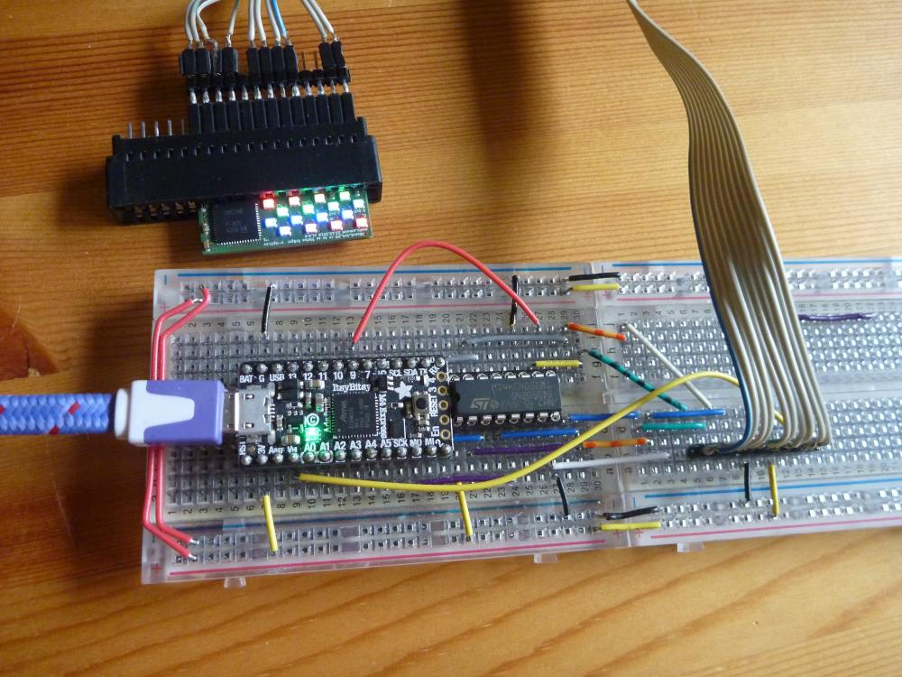

<!--lint disable list-item-indent-->
<!--lint disable list-item-bullet-indent-->

# LEDBoard_4x4_HD
PCB originally designed for [magic_amulet](https://github.com/s-light/magic_amulet),  
but now used in [magic_crystal](https://github.com/s-light/magic_crystal)





Overall Size:  
33mm x 14mm

### PCB
4layer board - uses 150mil traces and 100mil trace spacing  
shown pcb came from [aisler](https://aisler.net/s-light/magic_amulet/led-board-4x4-hd)

### parts
LED-Driver: [TLC5957](http://www.ti.com/lit/ds/symlink/tlc5957.pdf) (48ch CC 9-16Bit-PWM driver)  
more information in AppNote [Build a High-Density, High-Refresh Rate, Multiplexing Panel With the TLC5957](http://www.ti.com/lit/ug/slvuaf0/slvuaf0.pdf)

LED: [Rohm MSL0402RGBU](https://www.rohm.com/products/led/chip-leds-multi-color-type/msl0402rgbu-product) (1.8x1.6x0.5mm RGB)

### BOM
can be ordered with aisler parts-package  
or also with this [list at mouser](https://www.mouser.com/ProjectManager/ProjectDetail.aspx?AccessID=e53c13ed09)  
or with plain part numbers:
```
Qty.    Mfr. No             Manufacturer            Description
16      MSL0402RGBU1        ROHM Semiconductor      Standard LEDs - SMD RGB 624/527/470nm 5V 400/550/180mcd 30mA
1       TLC5957RTQR         Texas Instruments       LED Lighting Drivers 48-channel, 16bit ES PWM LED driver
2       GRM188R61A226ME15D  Murata                  Multilayer Ceramic Capacitors MLCC - SMD/SMT 0603 22uF 10volts *Derate Voltage/Temp
2       GCM188R91E104KA37D  Murata                  Multilayer Ceramic Capacitors MLCC - SMD/SMT 0603 0.1uF 25volts X8R 10%
1       ERJ-PB3B7501V       Panasonic               Thick Film Resistors - SMD 0603 Anti-Surge Res. 0.1%, 7.5Kohm
```

### power & cooling
if you want to drive the leds with full power (up to 25mA/color)
you definitely need a heatsink.  
the pcb backside get to >= 60°C very fast without a heatsink!

also remember that one board needs up to 1.2A@5V = 6W


### constant current

```
RIREF(kΩ) = VIREF(V) / IOLCMax(mA)× Gain  | / Gain
RIREF(kΩ) / Gain = VIREF(V) / IOLCMax(mA)  | swap
Gain / RIREF(kΩ) = IOLCMax(mA) / VIREF(V)  | x VIREF(V)
Gain / RIREF(kΩ) x VIREF(V) = IOLCMax(mA)

Gain / 7.4kΩ x 1.2V = IOLCMax(mA)

```
|  Gain |  BC | IOLCMax |
| ----: | --: | ------: |
|  20.0 | 0x0 |   3.2mA |
|  39.5 | 0x1 |   6.4mA |
|  58.6 | 0x2 |   9.5mA |
|  80.9 | 0x3 |  13.1mA |
| 100.0 | 0x4 |  16.2mA |
| 113.3 | 0x5 |  18.4mA |
| 141.6 | 0x6 |  23.0mA |
| 154.5 | 0x7 |  25.0mA |

### Software
- [arduino library](https://github.com/s-light/slight_TLC5957)
- [CircuitPython library](https://github.com/s-light/slight_CircuitPython_TLC5957)
